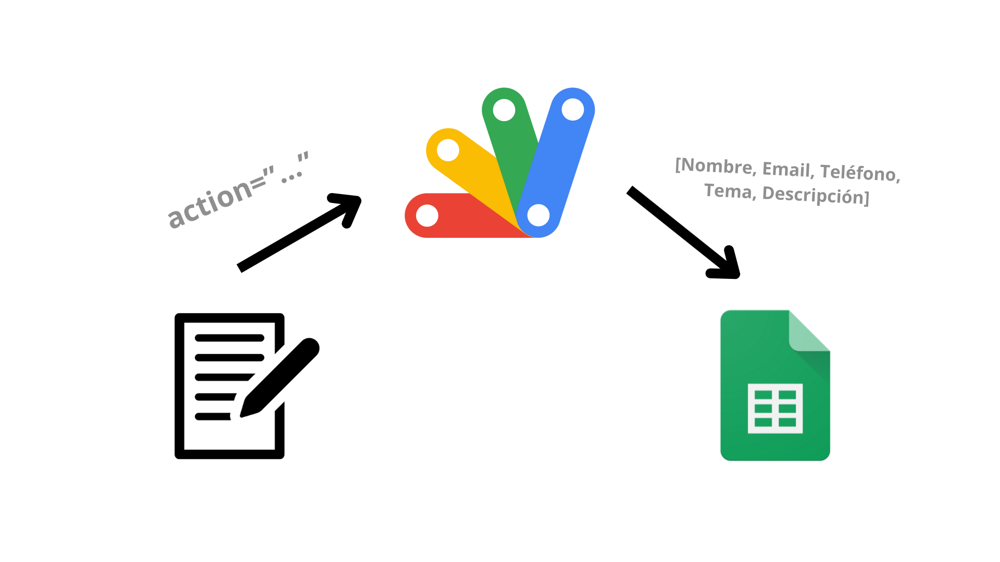

[Enlace a la página](https://r4at-00.github.io/Sneakers/html/main.html)
# Sneakers

<p style="color:gray;">Diego Francisco Padilla Villar 1ºDAM A<p>

Se trata de un proyecto realizado para la evaluación de los conocimientos aprendidos de HTML y CSS en el módulo LND. A continuación, pasaremos a detallar lo que vendría siendo la estructuración del proyecto y los cambios añadidos de cara a alcanzar la máxima nota.

*Por otra parte, el código está documentado, para que las decisiones elegidas en la etapa de desarrollo sean totalmente legibles para personas ajenas al equipo.*

## Estructura del proyecto

Nuestra página web contiene una [página de inicio](html/main.html), una [tienda](html/shop.html), una página [sobre nosotros](html/about.html) y otra para [contactar](html/contact.html) con el usuario. Luego, en cada una de ellas podremos encontrar una cabecera, con el icono y el nombre de nuestra tienda; una barra de navegación y dos botones para iniciar sesión y registrarse en nuestra base de datos. Al final de cada página, encontramos un pie de página en el cual podrás encontrar enlaces de interés a nuestra compañía, ayuda, el catálogo de nuestra tienda y nuestras redes sociales.

En cuanto a nuestra página de inicio, podremos encontrar un <abbr title="elemento que permite mostrar múltiples imágenes.">slider</abbr> que mostrará lo último de nuestro catálogo. También, te explicamos de qué se trata uno de nuestros productos estrella: los sneakers.

Si nos adentramos en la tienda, encontrarás nuestro catálogo con los sneakers más vanguardistas de todo el mercado. Cada sneaker tiene a su disposición una gama de colores, así dejamos que elijas el sneaker que mejor se ajuste a tus outfits preferidos.

Pasando por nuestra página auto-biográfica, podrás enterarte de nuestros objetivos en la industria de la moda y la propuesta artística que queremos desarrollar. También, dejamos a la vista nuestras redes sociales más activas.

Finalmente, si quieres contactar con nosotros debes de rellenar el formulario que te dejamos en la página. Si no te sientes cómodo, también puedes mandarnos un email a info@allshoes.es o contactarnos por mensajería privada en cualquiera de las redes sociales que te proporcionamos.

## Cambios añadidos (subir nota)

Hemos añadido los siguientes cambios:

1. **Cambios mayores**

   - Realizamos una composición musical mediante el software REAPER y la implementamos en el diseño de la página web. En especial, los elementos de audio se alojaron en el head. Se puede ejecutar pulsando el icono del logo:

     

     Para la realización de esta implementación, se aprovechó el atributo `onclick` para ejecutar la función [**`playpause()`**](js/main.js) de nuestro archivo JavaScript.

     ```javascript
     isPlaying = false;
     function playpause(){
         if (isPlaying){
             // Busca en el html el elemento con dicho id y pausa el audio
             document.getElementById('musica').pause();
             isPlaying = false;
         } else {
             document.getElementById('musica').play();
             isPlaying = true;
         }
     }
     ```

   - Mediante la [asistencia](https://chatgpt.com/share/67d6385c-92a0-800d-ade8-6c41e61c212d) de <abbr title="ChatGPT">tecnologías de razonamiento avanzado</abbr>, implementamos funciones del lado del servidor al formulario de la página de contacto. Una vez que los datos se han rellenado, se pulsa el botón de envío y un código de JavaScript alojado en Google AppScript actuará de intermediario entre el formulario y una hoja de cálculo en la cual se volcarán los datos recogidos del usuario.

     

     El código en AppScript es el siguiente:

     ```javascript
     function doPost(cliente) {
       var hojaCalculo = SpreadsheetApp.openById("1lOk4uXqHCMeb6MuzD29NC3EDCXLcPgbco1M_x3S7d9A");
       var hojaMain = hojaCalculo.getSheetByName("Main");
       var registro = [
         cliente.parameter.name, 
         cliente.parameter.email, 
         cliente.parameter.number, 
         cliente.parameter.tema, 
         cliente.parameter.desc
       ];
       
       hojaMain.appendRow(registro);
       
       return ContentService.createTextOutput("Datos registrados correctamente. Puedes regresar a la página original.");
     }
     ```

     Primero busca la hoja de cálculo mediante su ID, para luego acceder a la hoja Main y volcar los datos pasados por el parámetro `cliente`, es decir, los datos del formulario.

     Enlace a la hoja de cálculo: [SneakersBD](https://docs.google.com/spreadsheets/d/1lOk4uXqHCMeb6MuzD29NC3EDCXLcPgbco1M_x3S7d9A/edit?usp=sharing).

2. **Cambios menores**

   - Hemos modificado el slider para que esté alineado con la info sobre el sneaker:

     

     Se puede revertir modificando el width de la clase [slider](css/main.css):

     ```css
     .slider{
         width:90%;
     }
     ```

   - Añadimos una transición hover a los enlaces dispuestos en el footer:

     

   - Al hacer click en los botones "ADD TO CART" de la tienda, se mostrará un mensaje de alerta en el navegador:

     

     ```javascript
     function stock() {
         alert("NO HAY STOCK");
     }
     ```
   - El icono a la pestaña fue añadido:

      

   - Cuando pasas el ratón por encima del slider, se pausará:

     

     Esto ocurre ya que fue implementada esta línea de código:

     ```css
     .slider:hover .slider-card{
          animation-play-state: paused;
     }
     ```